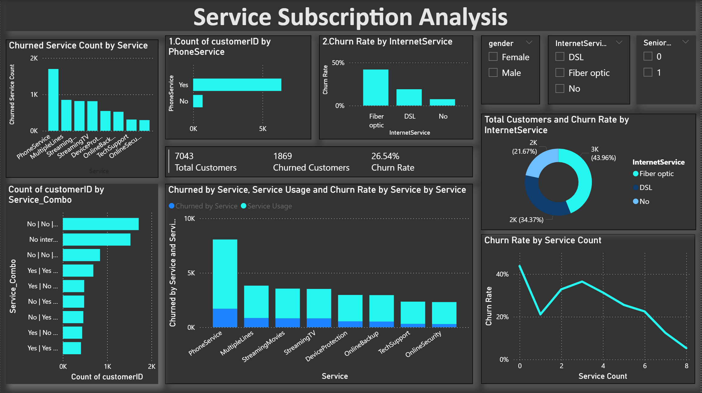
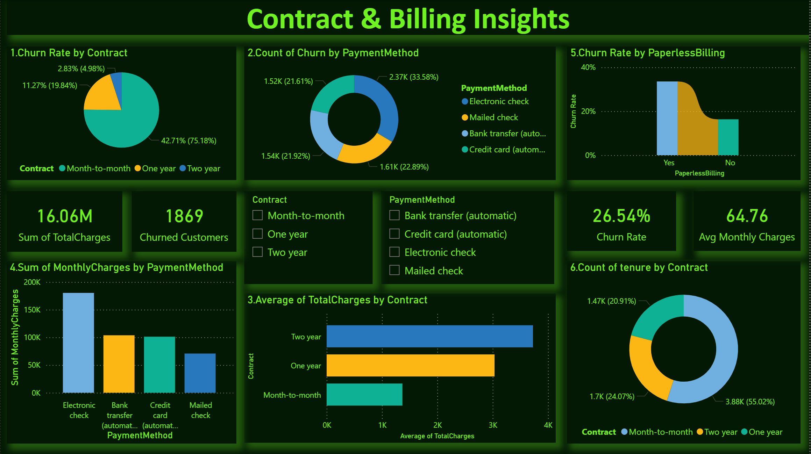
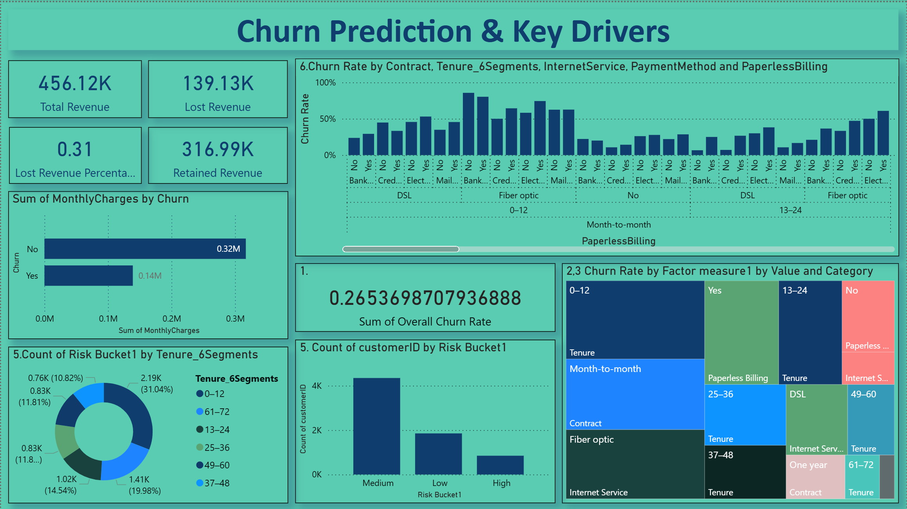

# 📊 Customer Churn Analysis using Power BI

An end-to-end **Customer Churn Analysis** project built using **Power BI**, focused on identifying churn patterns, high-risk customer segments, and key business drivers impacting customer retention and revenue.

This project transforms raw telecom customer data into **actionable insights** through interactive dashboards, advanced DAX measures, and business-driven storytelling.

---

## 🚀 Project Objectives

- Analyze customer churn behavior across demographics, services, contracts, and billing methods
- Identify **key churn drivers** and high-risk customer segments
- Quantify **revenue loss vs retained revenue**
- Support **data-driven retention strategies** using visual insights

---

## 🗂 Project Structure

```text
Customer-Churn-Analysis/
│
├── Dataset/
│   └── Customer-Churn.csv
│
├── PowerBI/
│   └── Customer Churn Analysis.pbix
│
├── Screenshots/
│   ├── churn_drivers.png
│   ├── contract_billing.png
│   ├── customer_demographics.png
│   └── service_subscription.png
│
├── DAX_Calculations.md
├── README.md
```

## 🧾 Dataset Overview

The dataset represents telecom customer subscription data with the following key attributes:

- Customer demographics (Gender, Senior Citizen)
- Account information (Tenure, Contract type, Payment method)
- Services subscribed (Internet, Phone, Streaming, Security, Tech Support)
- Billing details (Monthly Charges, Total Charges, Paperless Billing)
- Target variable: **Churn (Yes / No)**

---

## 📌 Dashboards & Analysis Modules

### 1️⃣ Customer Demographics Analysis
**What this dashboard covers:**
- Gender distribution and churn comparison
- Senior citizen churn behavior
- Tenure-based customer segmentation
- Churn rate variation across tenure groups
- Monthly charge trends by tenure and gender


**Key Insight:**  
Early-tenure customers (0–12 months) churn the most, while gender has minimal impact on churn.

---

### 2️⃣ Service Subscription Analysis
**What this dashboard covers:**
- Churn by internet service type (DSL, Fiber optic, No internet)
- Add-on services impact on churn
- Risky service combinations
- Churn rate vs number of subscribed services



**Key Insight:**  
Fiber-optic customers show the highest churn, while customers with more bundled services churn less.

---

### 3️⃣ Contract & Billing Insights
**What this dashboard covers:**
- Churn rate by contract type
- Payment method vs churn distribution
- Paperless billing impact on churn
- Monthly and total charge trends by contract
- 


**Key Insight:**  
Month-to-month contracts and electronic check payments have the highest churn rates, while two-year contracts retain customers best.

---

### 4️⃣ Churn Prediction & Key Drivers
**What this dashboard covers:**
- Overall churn rate and revenue impact
- Lost vs retained revenue analysis
- AI-inspired churn risk segmentation (Low / Medium / High)
- Multi-factor churn concentration analysis



**Key Insight:**  
Tenure, contract type, and internet service are the strongest churn drivers, with most customers falling into the medium-risk segment.

---

## 📈 Key Business Metrics

- **Total Customers:** 7,043  
- **Churned Customers:** 1,869  
- **Overall Churn Rate:** 26.54%  
- **Avg Monthly Charges:** 64.76  
- **Avg Tenure:** 32.37 months  

---

## 🧠 Challenges Faced

1. **DAX Measure Design**  
   Building accurate KPIs (Churn Rate, Risk Buckets, Revenue Impact) required iterative testing and validation.

2. **Overlapping Metrics Interpretation**  
   Separating the influence of tenure, contract, and charges without conflicting insights was challenging.

3. **Insight Prioritization**  
   Identifying meaningful churn drivers while avoiding visual clutter required careful business reasoning.

---

## 🛠 Tools & Technologies

- **Power BI Desktop**
- **DAX (Data Analysis Expressions)**
- **Data Modeling & Star Schema**
- **Data Cleaning & Transformation**
- **Business Analytics & Storytelling**

---

## 🎯 Key Takeaways

- Early customer engagement is critical for retention
- Long-term contracts significantly reduce churn
- Payment method and service bundling strongly influence customer loyalty
- Medium-risk customers offer the highest opportunity for churn prevention

---

## 📌 How to Use This Project

1. Download the `.pbix` file
2. Open using **Power BI Desktop**
3. Interact with slicers (Gender, Contract, Internet Service)
4. Explore insights across dashboards

---

## 📬 Contact

If you have feedback, questions, or would like to collaborate, feel free to connect.

**Author:** Manikanta Chundu  
**Domain:** Data Analytics | Power BI | Business Intelligence

---

⭐ If you found this project insightful, don’t forget to star the repository!
